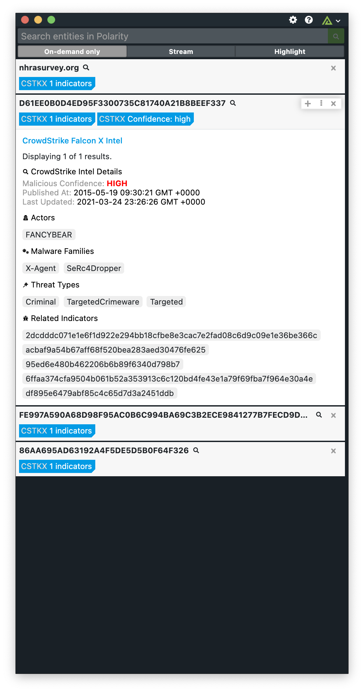

# Polarity Crowdstrike Falcon X Intel Integration

The Polarity Crowdstrike Falcon X Intel integration displays enrichment data related to various indicator types from the Crowdstrike Falcon X Indicators API.

## Creating a Client ID / Client Secret

Before using the Polarity Crowdstrike Integration you will need to create a Client ID and Client Secret to connect to Crowdstrike with.  The following steps will guide you through the process:

1. Log onto the Crowdstrike Falcon console.
2. Go to `Support > API Client and Keys`.
3. Click `Add New API Client`.
4. A dialog will appear, enter the name of the integration (e.g. `Polarity`) and a description (optional).
5. Polarity will need `Read` access to `Indicators (Falcon X)`.
6. Click `Add`. Record the Client ID and Client Secret (Client secret will only be shown once for security purpose, so make sure to store it in a secure place).

Use the Client ID and Client Secret that you recorded previously to fill out the integration options. You are now ready to use the Polarity integration with Crowdstrike Falcon X!

## Crowdstrike Falcon X Intel Integration Options

### Crowdstrike API URL

The REST API URL for your Crowdstrike instance which should include the schema (i.e., http, https) and port if required.  Defaults to `https://api.crowdstrike.com`.

### Client ID

The Client ID to use to connect to Crowdstrike.

### Client Secret

The secret associated with the Client ID.

### Minimum Malicious Confidence

The minimum malicious confidence level required for indicators to be displayed. Defaults to `Medium`.

## Polarity

Polarity is a memory-augmentation platform that improves and accelerates analyst decision making.  For more information about the Polarity platform please see:

https://polarity.io/
